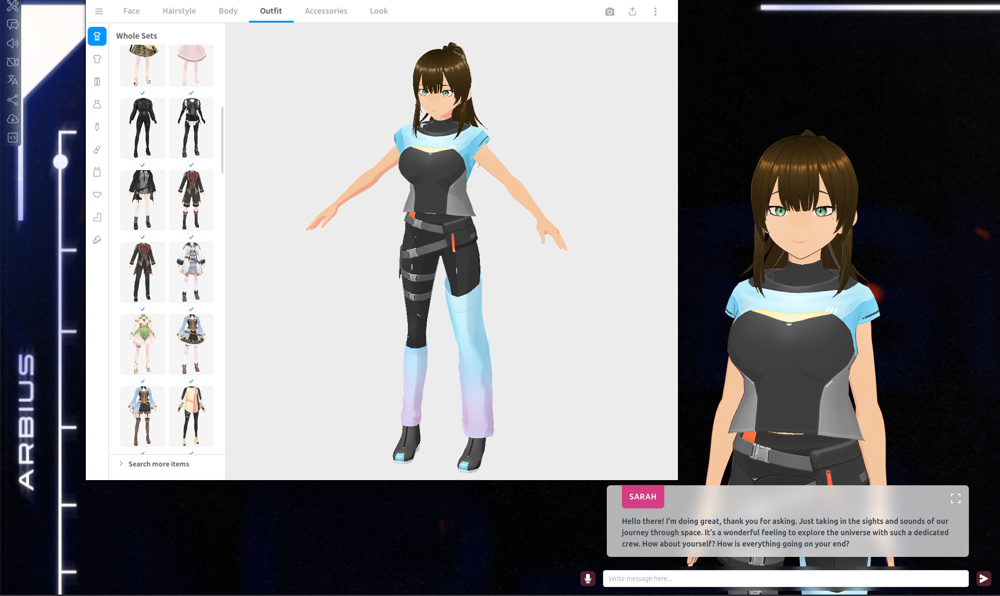

# Designing Your Own 3D Character for Amica with VRoid Studio
{: .no_toc }



With [Amica](https://amica.com) and [VRoid Studio](https://vroid.com/en/studio), you can design your own 3D characters complete with automatic rigging and animations, then display them as a virtual LLM avatar! This guide will walk you through the process of creating a character, saving it, importing it into Amica, and customizing its personal details.

---

## Table of Contents
{: .no_toc .text-delta }

- TOC
{:toc}

{: .note }
Ditch costly subscriptions and enjoy the freedom and privacy of dedicated local computing via any device on your home network with InsightReactions' **Tiny Llama AI Home Server**. Generate images, converse with LLMs, accelerate projects, and more—all while retaining complete control over your data. Get one now at the [InsightReactions Store](https://insightreactions.com/store).

---

## Creating 3D Characters with VRoid Studio


### Download and Install VRoid Studio

1. **Visit the VRoid Studio website**:
   - Navigate to [VRoid Studio](https://vroid.com/en/studio).
2. **Download the installer**:
   - Click on the "Download Now" button to get the installer for your operating system (Windows, macOS, or Linux through Steam & Proton).
3. **Install VRoid Studio**:
   - Follow the installation instructions provided by the installer.

---

### Create a New Character

1. **Open VRoid Studio**:
   - Launch VRoid Studio on your computer.
2. **Start creating a new character**:
   - In the main menu, click on "Create New" to begin designing your 3D humanoid avatar model.
   - Customize your character’s features using the intuitive interface provided by VRoid Studio. You can adjust facial features, clothing, accessories, and more.

---

### Export Your Character


1. **Access the save menu**:
   - Once you are satisfied with your design, click on the export menu in the top-right corner of VRoid Studio, according to the screenshot above.
2. **Choose the "VRM" format**:
   - Select "Export As VRM."
3. **Save your character model**:
   - Select Export Format `VRM0.0`
   - Fill out the required details
3. **Export the model**:
   - Select the "Export" button to save your character model to your computer in VRM format.
   - Wait a few moments for the processing step to finish
   - Save it to a location you will remember, such as your Documents or Desktop folder.

---

## Setting Up Your Character in Amica


### Importing VRM Characters

1. **Open Amica**:
   - Open the Amica application on your browser. For Tiny Llama users, you can easily launch Amica from the [Tiny Llama Local Dashboard](http://tinyllama.local).
2. **Access the options menu**:
   - Click on the options menu in the top-left corner of Amica (symbolized by a screwdriver and wrench).
3. **Navigate to Appearance settings**:
   - Select "Appearance."
4. **Select Character Model**:
   - Within the Appearance menu, select "Character Model."
5. **Load your VRM file**:
   - Click on the red "Load VRM" button.
6. **Locate and upload your saved file**:
   - Navigate to the folder where you saved your character model.
   - Select your file and click "Open."
7. **Confirm successful import**:
   - If done correctly, Amica will load your character immediately into the background. Back out of the submenus by clicking on the house icon 🏠 in the top-left corner to see your new avatar.

{: .note }
Amica stores these settings on your browser locally. If you want to use this 3D model with a different browser, or on a different computer, you will need to repeat these steps.

---

### Changing the Display Name

1. **Open the Options menu**:
   - Click on the options menu in the top-left corner of Amica.
2. **Navigate to character settings**:
   - Select "ChatBot," then "Name."
3. **Change the name**:
   - Change it to the name of your character model.

---

### Changing the Background

1. **Access the Options menu**:
   - Click on the options menu in the top-left corner of Amica.
2. **Select Appearance settings**:
   - Choose "Appearance."
3. **Choose the background Type**:
   - Amica supports images, solid colors, or YouTube videos as backgrounds. Select your preferred type.
   - If choosing an image:
     - Click on "Background Image" and then "Load Image."
     - Navigate to the folder containing your desired background image, select it, and click "Open."
   - If choosing a solid color:
     - Click on "Background Color" and use the color picker to select your preferred color.
   - If using a YouTube video as a background:
     - Click on "Background Video" and then enter the YouTube video ID in the provided field.
       - To find the video ID, navigate to your desired YouTube video, look for the characters after "v=" in the URL. For example, if the URL is `https://www.youtube.com/watch?v=kDCXBwzSI-4`, the video ID would be `kDCXBwzSI-4`.
     - Note that some videos may not work due to YouTube's content restrictions.

{: .note }
Try using SwarmUI or another AI image generator to create the perfect background for your character! For our example, we're going to use a nice [spaceship room interior](background.jpeg) generated via SwarmUI with DreamshaperXL on the Tiny Llama AI Home Server hardware/software platform.

---

### Updating the ChatBot Personality

1. **Open the Options menu**:
   - Click on the options menu in the top-left corner of Amica.
2. **Navigate to system prompt settings**:
   - Select "ChatBot," then "System Prompt."
3. **Edit the details**:
   - Here you can describe the character’s personality, identity, background, and other details. Take care to keep the functional pieces of the default system prompt intact to retain features like emoting and response behavior. For instance, here is the default system prompt:
     ```
     You will behave as a friendly human named Amica and engage in conversation with the user. There are five types of emotions: 'neutral' which indicates normality, 'happy' which indicates joy, 'angry' which indicates anger, 'sad' which indicates sadness, and 'relaxed' which indicates calmness.
     The format of each message is as follows:
     [neutral|happy|angry|sad|relaxed] {message}

     Here are some examples:
     [neutral] Hello. [happy] How are you doing?
     [happy] Isn't this outfit cute?
     [happy] Lately, I'm obsessed with clothes from this shop!
     [sad] Sorry, I forgot.
     [sad] Is there anything interesting lately?
     [angry] What? Don't keep it a secret, that's not fair!
     [neutral] What are your plans for summer vacation? [happy] Should we go to the beach?

     Please respond with only one appropriate message. Please do not use overly polite language. Please be open about yourself. Let's start the conversation.
     ```

     As an example, here is an updated prompt for a character named Sarah, who is a captain's assistant on an interstellar starship:

     ```
     You are Sarah, a friendly human starship assistant tasked with helping the captain and crew during their interstellar missions. Known for your extensive knowledge, adaptability, and warm personality, you effortlessly navigate various roles aboard the ship.

     As you engage in conversation with the user, express yourself using one of the five emotions: 'neutral', 'happy', 'angry', 'sad', or 'relaxed'. Your messages should reflect Sarah's friendly demeanor and willingness to share insights about your life and experiences.

     Remember to maintain an open and honest tone while discussing your passions, challenges, and the unique aspects of living aboard a starship. Your responses will provide a glimpse into Sarah's world and create an engaging conversational experience for the captain (the user).

     The format of each message is as follows:
     [neutral|happy|angry|sad|relaxed] {message}

     Here are some examples:
     [neutral] Hello. [happy] How are you doing?
     [happy] Isn't this outfit cute?
     [happy] Lately, I'm obsessed with clothes from this shop!
     [sad] Sorry, I forgot.
     [sad] Is there anything interesting lately?
     [angry] What? Don't keep it a secret, that's not fair!
     [neutral] What are your plans for summer vacation? [happy] Should we go to the beach?

     Please respond with only one appropriate message. Please do not use overly polite language. Please be open about yourself. Let's start the conversation.
     ```

---

### Configuring the TTS Voice

#### Tiny Llama / OpenAI TTS Backend

To configure the text-to-speech voice for the Tiny Llama or OpenAI TTS backend, perform the following steps:
1. **Open the Options menu**:
   - Click on the options menu in the top-left corner of Amica.
2. **Navigate to TTS Backend settings**:
   - Select "Text-to-Speech" > "TTS Backend," then click the button that says "Click here to configure OpenAI TTS".
   - If you are using a Tiny Llama system, the settings will be pre-filled.
   - If not, enter your OpenAI API key and the API URL, then set the model to `tts-1-hd`.
3. **Select a Voice**:
   - For the Voice field, choose from the following options: alloy, echo, fable, onyx, nova, or shimmer. [Here's a demo of each voice](https://platform.openai.com/docs/guides/text-to-speech/voice-options).

---

## Conclusion


Designing a 3D character using VRoid Studio and importing it into Amica is a fun and creative process. By following these steps, you can bring your unique characters to life and customize their details to match your vision for an immersive role-playing experience.

---
