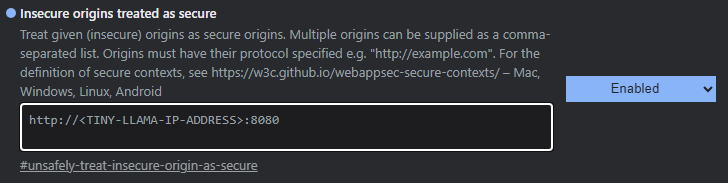

# Allow Microphone in Open WebUI
{: .no_toc }

You may have seen this error message when trying to use voice recognition features in Open WebUI:

In this guide, we'll teach you how to allow microphone access for Open WebUI. This will enable you to use voice recognition features within the application, such as Speech-To-Text (STT).

---

## Table of Contents
{: .no_toc .text-delta }

- TOC
{:toc}

{: .note }
Ditch costly subscriptions and enjoy the freedom and privacy of dedicated local computing via any device on your home network with InsightReactions' **Tiny Llama AI Home Server**. Generate images, converse with LLMs, accelerate projects, and more—all while retaining complete control over your data. Get one now at the [InsightReactions Store](https://insightreactions.com/store).

---

## Why Is Microphone Access Disabled by Default?

By default, browsers have security measures that block websites from accessing your microphone without explicit permission. Only enable microphone access if you're using the application within your local network or a VPN due to potential privacy risks when accessed over public networks.

Configuring this will depend on your specific browser and operating system. To make the microphone work, you need to configure your browser to treat the website as secure (https).

---

## Fixes for Common Browsers
The table below provides general instructions for some popular browsers:

| Browser | Instructions |
|---------|--------------|
| Brave | [Brave Forum](https://community.brave.com/t/removing-secure-window-in-url-bar/451202/6) (post 6) |
| Chrome/Chromium | [StackOverflow](https://stackoverflow.com/questions/34883621/chrome-flag-for-unsafely-treat-insecure-origin-as-secure) |
| Edge | [Microsoft Forum](https://learn.microsoft.com/en-us/answers/questions/621757/how-to-get-rid-of-not-secure-mark-in-edge-browser) (first answer, option 2) |
| Firefox | Unsupported |
| Opera | [StackOverflow](https://stackoverflow.com/questions/34883621/chrome-flag-for-unsafely-treat-insecure-origin-as-secure) (use `opera://flags` instead of `chrome://flags`) |
| Safari | Unsupported                                                                              |
| Vivaldi | [Vivaldi Forum](https://forum.vivaldi.net/topic/79419/whitelist-for-intranet-http-sites/)                  |

Please note that these instructions are general and may not be accurate for your specific setup or version of the browser. If you're having trouble, it might be helpful to search online for more specific instructions based on your exact situation.

---

### Example: Microsoft Edge
Here is an example of how to allow microphone access in Microsoft Edge, with a placeholder for the IP address:
1. In Edge, type `edge://flags/` into the URL bar and press Enter.
2. Search for "Insecure origins treated as secure".
3. Enter the IP address to your Tiny Llama instance (e.g., `http://192.168.0.52:8080`) in the text box next to this option, then click Enable. Note: You must include "http" at the beginning of the URL and specify port ":8080".
4. Restart Edge for changes to take effect.

---
