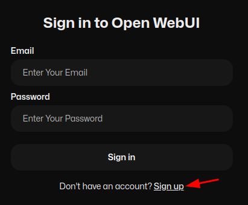
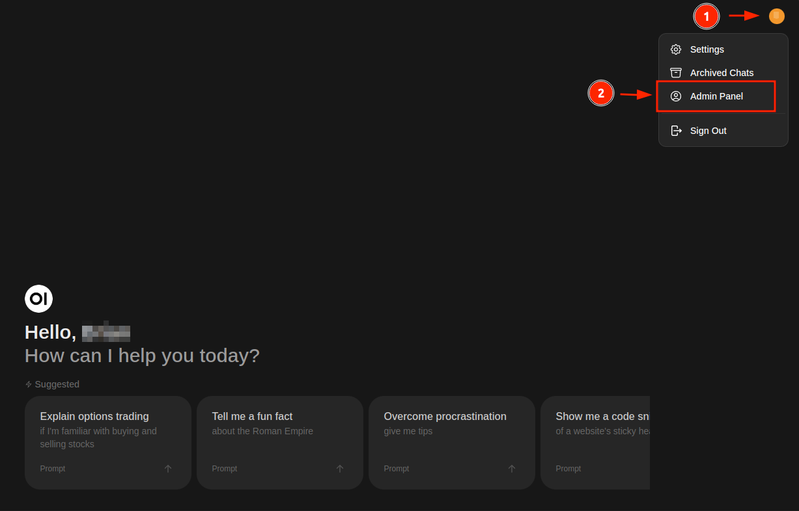
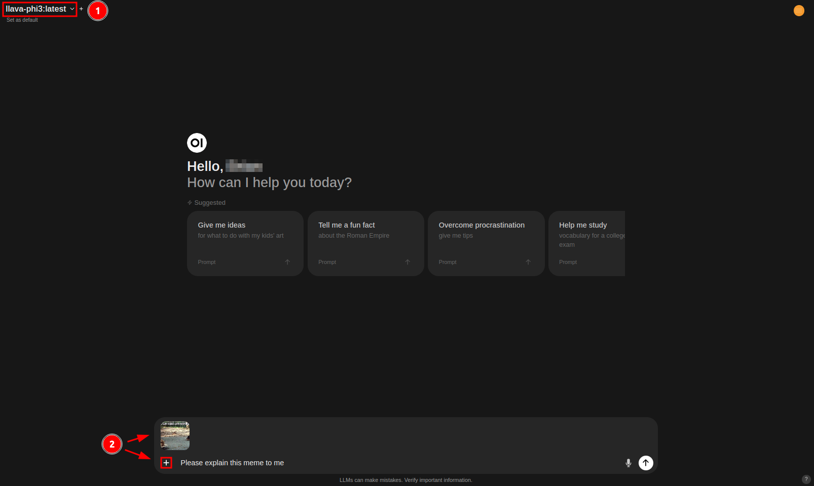
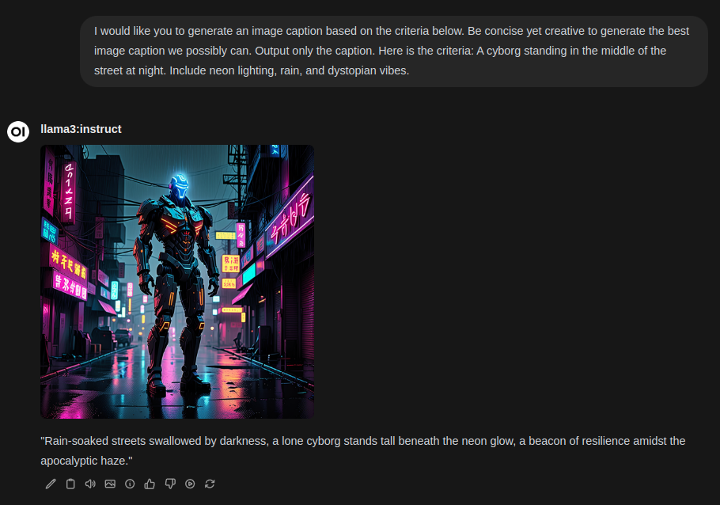

# Getting Started with Open WebUI
{: .no_toc }

## Table of Contents
{: .no_toc .text-delta }

- TOC
{:toc}

## Initial Setup

### Accessing Open WebUI

To get started, navigate to the tinyllama.local landing page and click on "Open WebUI" to access the service. You'll be directed to a sign-in page.

### Creating an Account

If this is your first time accessing Open WebUI, you'll need to create an account. Click the "Sign up" button and enter your name, email address, and password. Please note that all account information and associated data will be stored securely on the device.

### Resolving Account Issues

If someone else has already created an account on this device, you may encounter a message indicating that an account activation is pending. In this case, the original account holder (listed as "Admin") must log in and approve your new account to grant access. To resolve this issue, follow our [Account Activation](#account-activation) procedure.

## Account Activation
Follow these steps to activate an account.

### Access the Administrator Panel
Log in to Open WebUI with the administrator account (usually the first account created). Click on your profile icon and select "Admin Panel".

### Promote the Pending User
From the Admin Panel, locate the user account with a pending role. Click on the "pending" role to change it to the "user" role.

If you want to grant additional permissions, click on the "user" role again to promote the account to the "admin" role. This will allow the user to access the Admin Panel and other configuration settings associated with Open WebUI.

## How to Chat

1. To start a new conversation, click on the "New Chat" button in the top-left corner of the Open WebUI interface once you're logged in.

2. You can choose a model that best fits your task. By default, llama3.1 is selected, which is a versatile generalist model suitable for various everyday tasks. For more information about the purposes of other models, please refer to our [Model Selection](#model-selection) section.

3. To send a message, type it into the message field located at the bottom of the window. You can also upload documents for reference during the conversation by clicking on the "+" icon on the left side of the message bar.

4. Once you've entered a message, click the up arrow icon to submit it to the LLM (Large Language Model).

{: .note}
Please wait 5-10 seconds for the model to load into memory for the initial response. Once loaded, the delay will be shortened to less than 1 second. The model will stay loaded in memory and waiting for responses for up to 5 minutes before freeing up that memory for other tasks.

{: .important }
Due to memory limitations, the Tiny Llama AI Home Server (2024) is roughly constrained to a 2048 token context window, which is equivalent to ~1,500 words in total, including the entirety of the conversation. In many cases, it's preferable to only copy and paste relevant sections of a document.

## Model Selection
To select a model, click on the model name at the top of the chat window. You can choose from several options, and you can even select multiple models using the "+" sign to simultaneously compare their responses.

By default, Tiny Llama ships with these models available for selection:

1. **llama3.1:** A generalist model developed by Meta, suitable for many day-to-day tasks. Llama 3.1 instruction-tuned models are fine-tuned and optimized for dialogue/chat use cases, outperforming most other open-source chat models on common benchmarks.

2. **hermes3:** A llama3.1 finetuned model from Nous Research, offering uncensored conversations without content filters or ethical guidelines. This makes it ideal for highly creative endeavors and prompt suggestions, such as roleplay.

3. **minicpm-v:** An LMM (Large Multi-modal Model) capable of reading/writing text and visual interpretation of image content. This model is great for transcribing text from images or basic scene interpretation. Ideally, it should be used in conjunction with other models like llama3.1 for the best experience, as its visual component may detract the model from higher-quality reading and conversational comprehension.

## Image Inference via Chat

To perform image inference, follow these steps:
1. Select a large multi-modal model capable of image inference, such as llava-phi3 or minicpm-v.
2. Attach the image to the message box by either copying and pasting an image or clicking on the "+" icon and selecting "Upload Files".

{: .note }
Keep in mind that while these models are improving at a fast rate, they're not perfect yet. However, you can still get great assistance with interpreting textual content like labels or mixed-media images that contain both text and image data. The more context you provide the model upfront, the better it will be at understanding the scene and providing a helpful response.

## Image Generation via Chat

Open WebUI is configured for image generation inference by default, using [CyberRealistic V4.2](https://civitai.com/models/15003?modelVersionId=372799) as its partner model. To generate an image with the assistance of your favorite Large Language Model (LLM), follow these steps:

1. Select an LLM to collaborate on your image generation journey. Llama3.1 is a suitable choice for most tasks.
2. Provide a specific caption prompt, including adequate context to help the model understand the task.
3. Once you've written and edited the caption as needed, click the image icon to submit it to SwarmUI for inference.
4. Wait for the image generation process to complete. The generated image will appear above the prompt. You can regenerate the image as many times as desired. If the caption doesn't quite meet your expectations, feel free to edit the LLM's response using the pen icon or regenerate the response and try again.

{: .note }
The initial image generation may take up to 5-10 seconds depending on system utilization and prompt parameters. Subsequent generations typically complete within 4 seconds, as the diffusion model remains in memory for up to 1 minute. After 1 minute, the diffusion model is unloaded to make room for other models.
