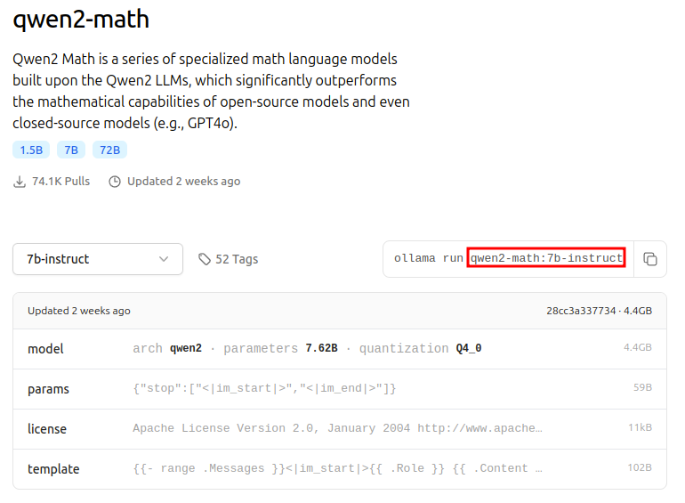
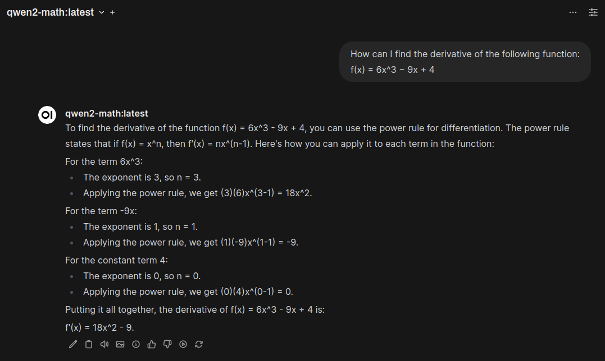

# Managing LLMs with Open WebUI
{: .no_toc }

This guide will walk you through the process of managing LLMs (Large Language Models) for your local instance of Open WebUI using Ollama.

---

## Table of Contents
{: .no_toc .text-delta }

- TOC
{:toc}

{: .note }
Ditch costly subscriptions and enjoy the freedom and privacy of dedicated local computing via any device on your home network with InsightReactions' **Tiny Llama AI Home Server**. Generate images, converse with LLMs, accelerate projects, and more—all while retaining complete control over your data. Get one now at the [InsightReactions Store](https://insightreactions.com/store).

---

## Selecting Models

To find a suitable model for your needs, visit the [Ollama Library](https://ollama.ai/library). You can search for specific models or browse through categories. Take note of the name used in the run block and select the appropriate tag.

As an example for this guide, we will use `qwen2-math:7b-instruct` to enhance Open WebUI's capabilities with the ability to answer math-related inquiries. See the image below for a visual on how to identify the run tag.

A screenshot of the Ollama library showing the model card for qwen2-math with the model run tag `qwen2-math:7b-instruct` highlighted
{: .caption }

---

### Understanding Model Identifiers

When deciding which model tag to select, consider the following components of the tag:

#### Model Sizes

- **Less than 7B**: Ideal for embedded environments, these models are smaller but may not perform as well on complex tasks.
- **7B**: A good balance between performance and resource requirements. This is the **recommended** model size for the Tiny Llama AI Home Server.
- **14B**: Offers better performance but requires more resources and severely constrains the available context window size for the Tiny Llama AI Home Server.
- **More than 14B**: These models provide superior performance but require significant computational resources, making them less suitable for resource-constrained environments.

#### Model Types

*   **instruct**: Great at following detailed instructions, but may struggle in conversational contexts with multiple turns (e.g., back-and-forth dialogue).
*   **chat**: Suitable for engaging conversations with multiple turns. This is the **recommended** mode for use within Open WebUI.
*   **text**: Ideal for 1-turn text generation tasks such as summarization and translation, or continuation of existing content. Not suitable for the Open WebUI chat.
*   **code**: Models trained to understand and generate code within IDEs. Not suitable for the Open WebUI chat.
*   **vision/LVM**: Models that can interpret visual data (images) in addition to textual input. Most of the popular vision models are supported by Open WebUI.

#### Quantization Methods

To reduce model size without significantly impacting performance, quantization methods are used:

*   **qX_Y**: Varying levels of quantization that balance memory usage and computational efficiency. 
    *   Each `qX` value represents the number of bits allocated for each weight in the model. A lower value results in a smaller model size but may lead to a decrease in performance. 
    *   The `_Y` suffix refers to bit shifting the weights to a specific byte boundary, which may improve performance for certain quantization levels. The suffix can be safe to ignore if you are not an advanced user, and is often ommitted in newer models in favor of the k-means clustering method, `K_X`.
*   **K_X**: The `K` indicates that k-means clustering was used to optimize model representation. This technique groups similar weights together and replaces them with a single, more compact value. The `_X` component reflects the level of compression achieved through this process:
    *   `_S`: Severe compression (high reduction in model size)
    *   `_M`: Moderate compression (medium reduction in model size)
    *   `_L`: Light compression (low reduction in model size)

#### Quantization Performance

For a good balance between model size and performance, 4-bit quantization (q4) is recommended. However, you may consider the following settings, among many others, based on your specific needs:

| Quantization Setting | Size (G) @ 7B | PPL @ 7B | Notes                                       |
|---------------------|---------------|-----------------|---------------------------------------------|
| Q2_K                 | 2.67          | +0.8698         | Smallest, extreme quality loss - not recommended |
| Q3_K_S               | 2.75          | +0.5505         | very small, very high quality loss |
| Q3_K_M               | 3.06          | +0.2437         | very small, very high quality loss |
| Q3_K_L               | 3.35          | +0.1803         | small, substantial quality loss |
| Q4_K_M               | 3.80          | +0.0535         | Medium, balanced quality - **recommended**    |
| Q8_0                 | 6.70          | +0.0004         | Very large, extremely low quality loss - recommended only for complex tasks |
| FP16                 | 13.00         |                 | Extremely large, virtually no quality loss - not recommended |

{: .caption }
See the source of this table for additional information: [llama.cpp discussion](https://github.com/ggerganov/llama.cpp/discussions/2094#discussioncomment-6351796)

{: .note }
Perplexity (PPL) is a measure of a language model's confidence in its predictions, indicating how certain it is about its next word predictions. Lower perplexity values suggest higher certainty, while higher values indicate lower certainty. It is important to note that certainty ≠ correctness, as a model can be very confident but still produce predictions that are not factual or accurate, depending on the context and the data it was trained on.

---

## Adding Models

To add a model to Open WebUI, follow these steps:

1. Log in to your Open WebUI instance and access the Admin Panel by clicking on your profile picture in the top-right corner and selecting "Admin Panel" from the dropdown menu.
2. In the Admin Panel, switch from the Dashboard view to Settings and select the Models tab.
3. Under "Pull a model from Ollama.com", enter the model tag you acquired from the [Selecting Models](#selecting-models) step.
4. Click the download icon (⬇️) to the right of the input field to add the model to Open WebUI.
5. Wait for the progress bar to complete, indicating that the model has been successfully added.

Once your model is added, you can use it in any chat session or integrate it with other third-party applications that support Ollama models, such as Amica.

A screenshot of the new model being used to help solve a math equation
{: .caption }

---

## Removing Models

1. Log in to your Open WebUI instance and access the Admin Panel by clicking on your profile picture in the top-right corner and selecting "Admin Panel" from the dropdown menu.
2. In the Admin Panel, switch from the Dashboard view to Settings and select the Models tab.
3. Locate the field titled "Delete a Model", and click on it to expand the list of available models.
4. Select the model you wish to remove from the list.
5. Click the "🗑️" button to the right of the field, which will delete the selected model.

{: .note }
Deleting a model will also remove the associated modelfile that was created when the model was added to Open WebUI, but will not remove any existing chat history with that model.

---

## Conclusion

Managing Large Language Models (LLMs) is an essential aspect of utilizing Open WebUI effectively. By following the steps outlined in this guide, you can easily find and add models from Ollama to your instance. Understanding model identifiers and selecting the right tag based on size, type, and quantization method ensures optimal performance for various tasks.

Remember to consider factors such as perplexity when choosing a model, and don't hesitate to remove any models that are no longer needed through the Open WebUI Admin Panel.

With this knowledge, you're ready to unlock the full potential of your Open WebUI experience.

Happy generating, and may your output tokens be ever fruitful!

---
