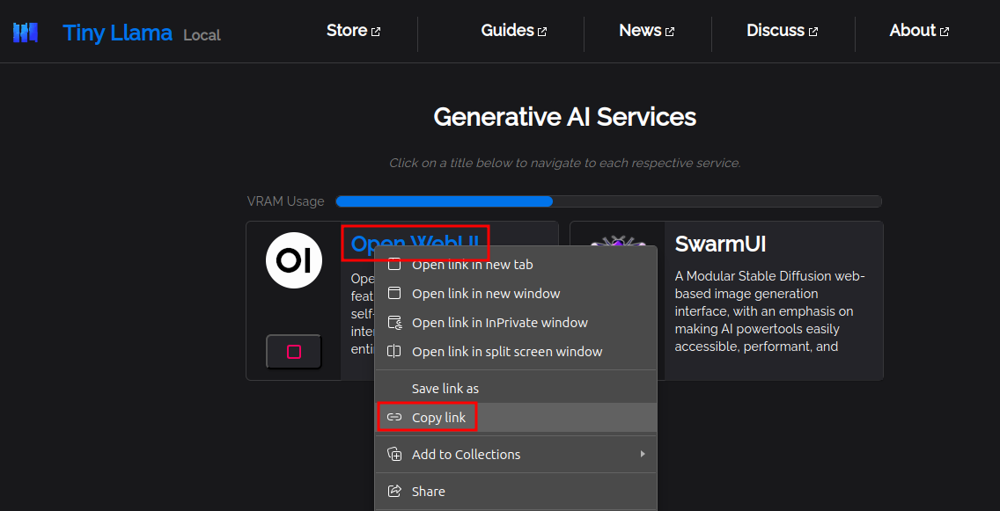
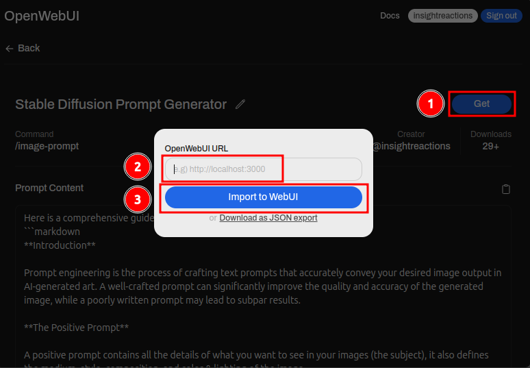
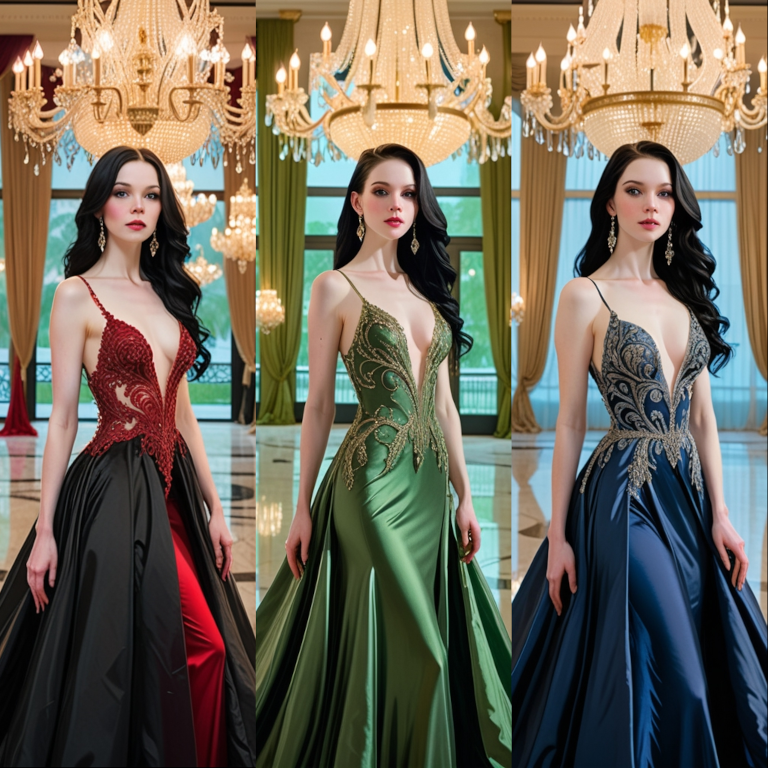

# Open WebUI Workspace Prompts
{: .no_toc }

Prompt: high quality, woman, attractive, happy, one hand waving at the camera, inviting expression, vibrant smile, anime, colorful, detailed textures, intricate patterns, warm and inviting atmosphere, pastel colors, soft lighting, looking at camera, black hair
{: .caption }

With the ability to automate repetitive tasks and free up time for more creative pursuits, workspace prompts are a game-changer. By harnessing their power, you can streamline your workflow, reduce mental fatigue, and unlock new possibilities.

To effectively demonstrate the utility of workspace prompts in this guide, we'll get into how to use the example "Stable Diffusion Prompt Generator" prompt, created by the InsightReactions team and hosted in the Open WebUI Community repository, to craft Stable Diffusion prompts that yield stunning images with any compatible image generation service.

## Table of Contents
{: .no_toc .text-delta }

- TOC
{:toc}

## Community Prompt Importing

1. Copy the Open WebUI host URL to your clipboard. For Tiny Llama Users, open a new browser tab and navigate to the [Tiny Llama Local Dashboard](http://tinyllama.local). Right-click on the link to navigate to Open WebUI and select "Copy". For standalone Open WebUI users, copy the same base URL used to navigate to Open WebUI on your system.
2. To download the prompt, navigate to the [Stable Diffusion Prompt Generator](https://openwebui.com/p/insightreactions/image-prompt/) and click on the `Get` button.
    
3. Right-click inside the text field and select "Paste".
4. Click the "Import to WebUI" button. You will then be automatically navigated to the Prompt creation window for the Open WebUI instance running on Tiny Llama, with all appropriate fields pre-filled.
5. Review the populated content, and click the "Create & Submit" button located in the bottom-right of the form to add the prompt to your Open WebUI instance.

{: .important }
To access the `Get` button, you may need to create a free account with the Open WebUI Community.

## Workspace Prompt Usage

<video width="736" controls autoplay loop>
    <source src="prompt-crafting.mp4" type="video/mp4">
    Your browser does not support the video tag.
</video>

To invoke the prompt in your chat, follow these steps:

1. Create a new Open WebUI Chat by clicking on "New Chat".
2. Ensure Llama3.1 or a similar quality model is selected
3. Invoke the "Stable Diffusion Prompt Generator" prompt by typing `/image-prompt` into the message box. Upon entering the `/`, a list of available prompts should show up, allowing you to select or scroll through the available prompts if you choose.
4. Next, enter a list of criteria at the end of the prompt. For example, criteria could be anything from "The feeling of fresh coffee in the morning" to "A woman under an umbrella in the pouring rain, soft light". Be as open-ended or specific as you'd like!
5. Submit the message when you're ready.

## Multi-turn Interactions

One of the most exciting aspects of including LLMs into the creative process is the ability to refine and adjust your results. You can ask Llama3.1 to modify its output in various ways, such as:

- Changing the pose or expression of a character
- Adjusting the clothing or accessories
- Altering the style or atmosphere of the image (e.g., from pastel to gritty, modern)
- Modifying the setting or environment

Simply ask Llama3.1 to make these changes, and it will dutifully perform them for you.
