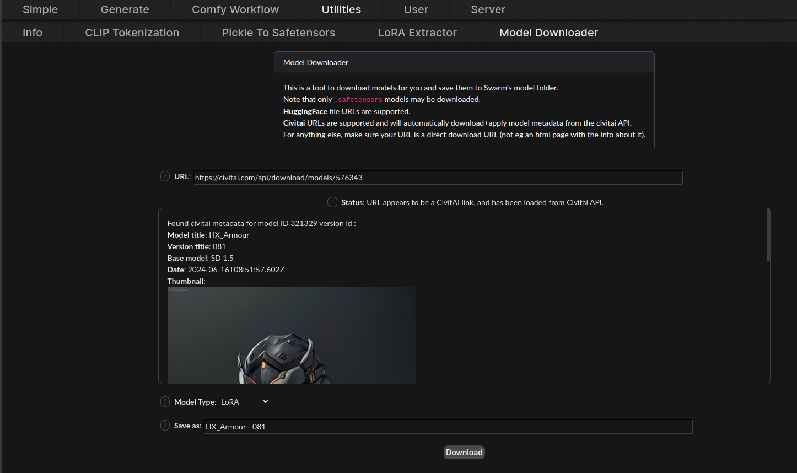
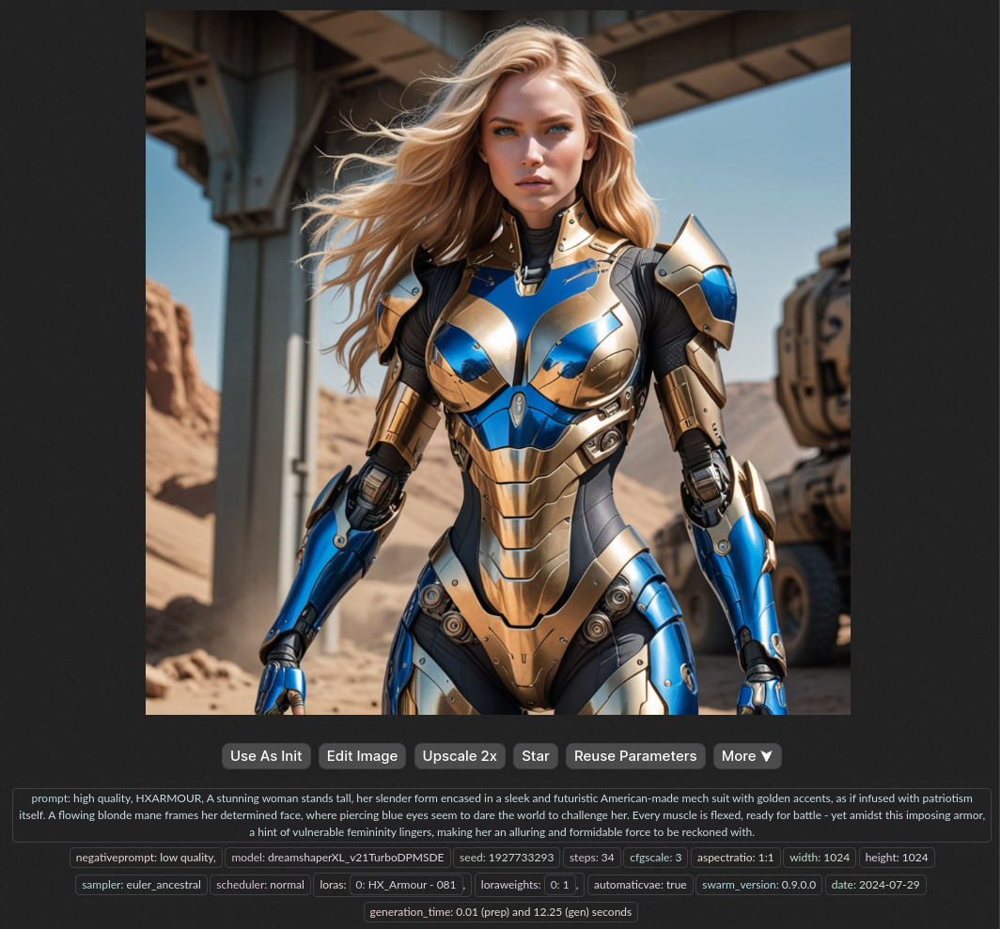

# Adding New Models with SwarmUI
{: .no_toc }

Are you ready to unlock the full potential of SwarmUI? SwarmUI's model download integration with Civit.ai is a game-changer, and we're here to walk you through it.

---

## Table of Contents
{: .no_toc .text-delta }

- TOC
{:toc}

{: .note }
Ditch costly subscriptions and enjoy the freedom and privacy of dedicated local computing via any device on your home network with InsightReactions' **Tiny Llama AI Home Server**. Generate images, converse with LLMs, accelerate projects, and more—all while retaining complete control over your data. Get one now at the [InsightReactions Store](https://insightreactions.com/store).

---

## Get Your Model's Civit.ai URL

To begin, go to your preferred model on [Civit.ai](https://civit.ai) and copy the URL for one of the supported model types (Checkpoint, LoRA, VAE, Embedding, or ControlNet).

## Open SwarmUI and Navigate to Model Downloader

Next, open up SwarmUI and head over to **Utilities** > **Model Downloader**. This is where the magic happens!

## Paste the Model URL and Verify Metadata

Paste the copied URL into the **URL field**, then verify that the returned metadata and Model Type are correct. This ensures we're working with the right model.

## Download Your Model

With everything confirmed, click the **Download** button and let SwarmUI do its thing. This might take a few moments, but trust us – it's worth it!

---

## Enjoy Your New Model!

Congratulations! You now have your new Civit.ai-powered model integrated with SwarmUI. Experiment, create, and explore – the possibilities are endless!

By following these simple steps, you'll be well on your way to unlocking the full potential of your models and taking your creative endeavors to the next level.

---
