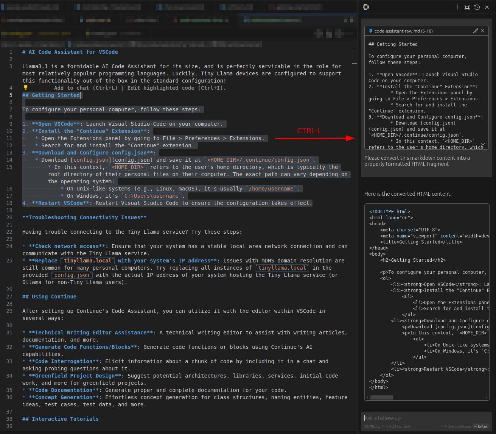

# AI Code Assistant for VSCode
{: .no_toc }
<video width="406" controls autoplay loop>
    <source src="code-assistant-intro.mp4" type="video/mp4">
    Your browser does not support the video tag.
</video>

Llama3.1 is a formidable AI Code Assistant for its size, and it's perfectly servicable in the role for most relatively popular programming languages. Luckily, Tiny Llama devices are configured to support this functionality out-of-the-box in the standard configuration!

## Table of Contents
{: .no_toc .text-delta }

- TOC
{:toc}

{: .note }
Ditch costly subscriptions and enjoy the freedom and privacy of dedicated local computing via any device on your home network with InsightReactions' **Tiny Llama AI Home Server**. Generate images, converse with LLMs, accelerate projects, and more—all while retaining complete control over your data. Get one now at the [InsightReactions Store](https://insightreactions.com/store).

## Getting Started
To configure your personal computer, follow these steps:
1. **Open VSCode**: Launch Visual Studio Code on your computer.
2. **Install the "Continue" Extension**:
   - Open the Extensions panel by going to File > Preferences > Extensions.
   - Search for and install the "Continue" extension.
3. **Install Tiny Llama's default `config.json`**:
   - Download [config.json](config.json) and save it at `<HOME_DIR>/.continue/config.json`.
4. **Restart VSCode**: Restart Visual Studio Code to ensure the configuration takes effect.

{: .note }
> In this context, `<HOME_DIR>` refers to the user's home directory, which is typically the root directory of their personal files on their computer. The exact path can vary depending on the operating system:
> 
> - On Unix-like systems (e.g., Linux, macOS), it's usually `/home/username`.
> - On Windows, it's `C:\Users\username`.

## Using Continue
After setting up Continue's Code Assistant, you can utilize it with the editor within VSCode in several ways:

- **Technical Writing Editor Assistance**: A technical writing editor to assist with writing articles, documentation, and more.
- **Generate Code Functions/Blocks**: Generate code functions or blocks by providing the task specification.
- **Code Interrogation**: Elicit information about a chunk of code by including it in a chat and asking probing questions about it.
- **Greenfield Project Design**: Suggest potential architectures, libraries, services, initial code work, and more for greenfield projects.
- **Code Documentation**: Generate proper and complete documentation for your code.
- **Concept Generation**: Effortless concept generation for class structures, naming entities, feature ideas, test cases, test data, and more.

## Interactive Tutorials

To get started with Continue, follow these steps to access some useful resources:

1. **Open the Command Palette**: Open the VSCode Command Palette by pressing `CTRL-SHIFT-P` with VSCode in focus.
2. **Search for "Continue: Focus on View"**: Search for and select the "Continue: Focus on View" command.
3. **View the Help Pane**: Click on the question mark icon in the bottom right of the now-focused window to view the help pane.
4. **Access the Resources**: From here, you can see the Documentation, [interactive] Tutorial, Keyboard Shortcuts, and more.

## Providing Chat Context

To get the most out of the Continue chat pane, you'll want to add specific sections of content that are relevant to your conversation. Here's how:

1. **Highlight the region**: Use your cursor to select the portion of content you'd like to work with.
2. **Press `CTRL-L`**: This will allow you to add context from various files and include it in the chat pane.
3. **Add as much detail as needed**: Repeat this process until all relevant information is included in the Continue chat pane.

Alternatively, you can add relevant content manually using [Markdown Fenced Code Blocks](https://www.markdownguide.org/extended-syntax/#fenced-code-blocks) or leverage [Continue's @ Context Provider](https://docs.continue.dev/customization/context-providers) functionality to pull additional information.

{: .important }
Please note that you can quickly run out of context window space when including context -- opt for including precise snippets over including large sections of documents to avoid running out of room for an adequate response.

With your contextual snippets in place, you can take advantage of the full potential of the chat pane. Ask questions about the content itself, request revisions to the design or layout, or even convert content between languages - for example, from markdown to HTML, or English to Spanish. This powerful tool also serves as a personal editor for writing technical documents, formatting LaTeX, and more, making it an indispensable companion for any project.

## Editing Content with the LLM
<video width="736" controls autoplay loop>
    <source src="code-assistant-edit-mode.mp4" type="video/mp4">
    Your browser does not support the video tag.
</video>

With Code Assistants, you can accelerate your development workflow by automating tasks like generating test data, writing entire functions, and even suggesting fixes for existing code. This feature lets you focus on what matters most – building innovative solutions.

### Editing Specific Regions

To edit a specific region of code, simply highlight it in your editor and press `CTRL-I`. A command drawer will then appear with an input field.

1. **Highlight the region**: Use your cursor to select the portion of content you'd like to work with.
2. **Press `CTRL-I`**: This will open a command drawer with an input field.
3. **Input changes**: Enter your desired changes into the input field. You can add relevant content using Markdown Fenced Code Blocks or leverage [Continue's @ Context Provider](https://docs.continue.dev/customization/context-providers) functionality to pull additional information. When you're finished, press Enter to submit your request.
4. **Review and apply changes**: The LLM will then review the highlighted region line by line, making the desired changes. Before applying the changes to the source file, you'll be given an opportunity to accept or reject them.

## Troubleshooting Connection Issues
Having trouble connecting to the Tiny Llama service? Try these steps:

1. **Check Network Access**: Ensure that your system has a stable local area network connection and can communicate with the Tiny Llama service.
2. **Use Server's IP Address**: Issues with mDNS domain resolution are still common for many personal computers. Try replacing all instances of `tinyllama.local` in the provided `config.json` with the actual IP address of your system hosting the Tiny Llama service (or Ollama for non-Tiny Llama users). Use the same IP address that appears in the URL when navigating to a Tiny Llama service, like Open WebUI.

## Additional Resources
For more technical information and help guides on Continue, visit [Continue's Official Documentation](https://docs.continue.dev/).
